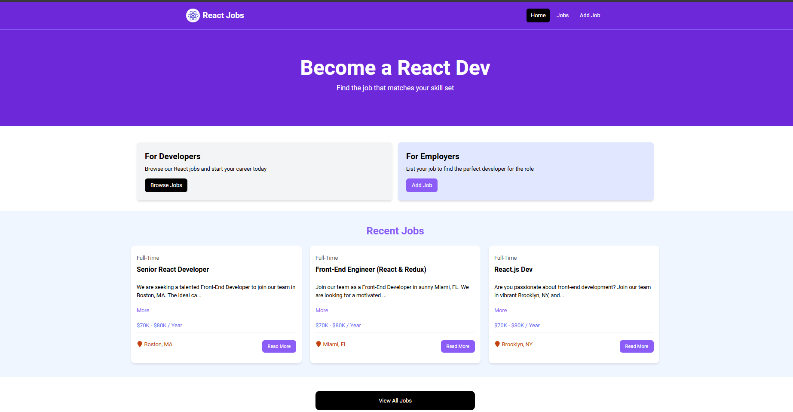
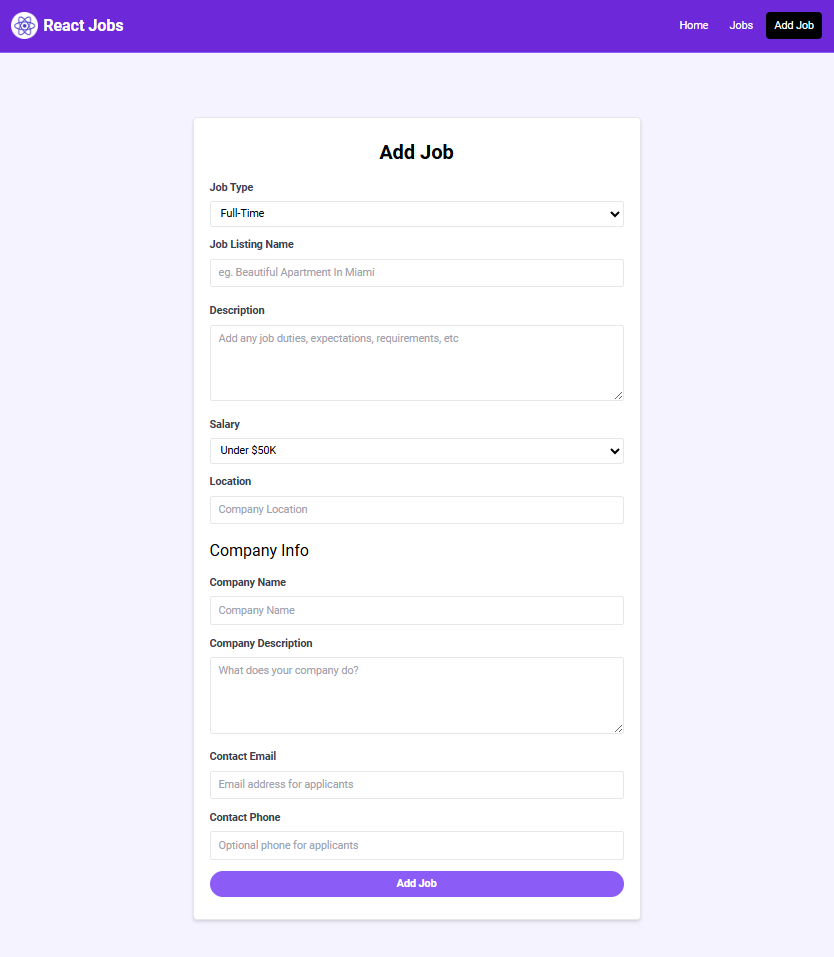
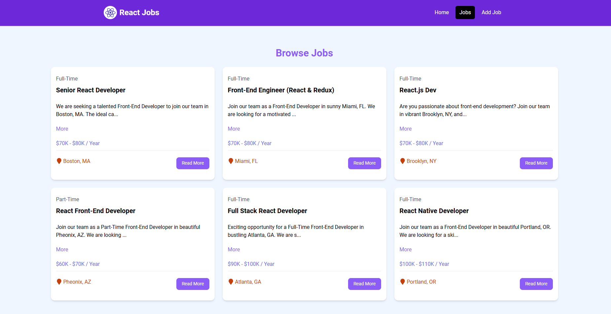
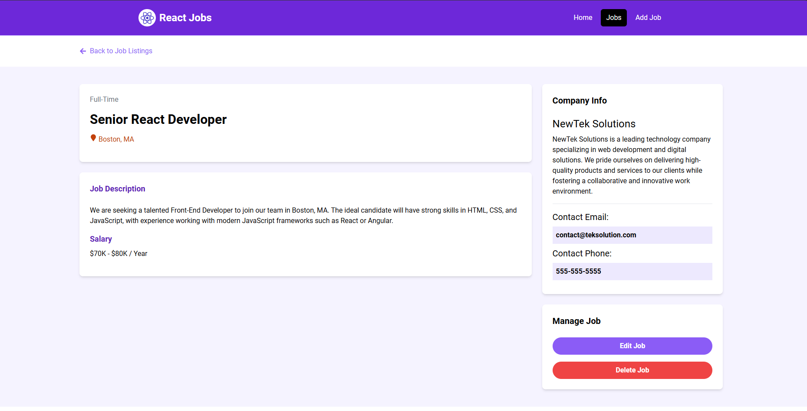
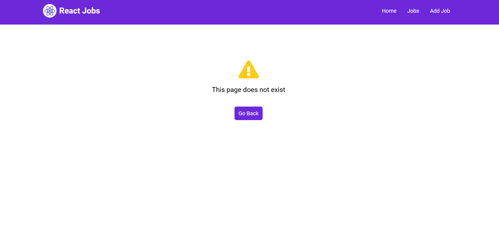

<<<<<<< HEAD
# Overview
This project is a job listing marketplace built using React 18, featuring various React features such as React Router to create a multi-page application, useState, useEffect, and fundamental concepts like states, props, Hooks, and data fetching. The project utilizes the JSON Server library to create a mock REST API, serving as the backend for job details.

#### Home Page
The main entry point for the job listing marketplace where you can easily navigate to different sections of the marketplace


#### Add Job Page
If you are a registered recruiter then you can add jobs to the marketplace for your company


#### Job Listings Page
Here is where all the available jobs are listed for the job seekers


#### Job Page
Here is where the job seeker can get in depth details about the available job


#### Custom 404 Not Found Page
In case the user navigates to an incorrect page which is not availble then a custom 404 not found page is rendered

=======
## Overview
This project is a job listing marketplace built using React 18, featuring various React features such as React Router to create a multi-page application, useState, useEffect, and fundamental concepts like states, props, Hooks, and data fetching. The project utilizes the JSON Server library to create a mock REST API, serving as the backend for job details.
>>>>>>> 0ed24d54a205c88ecb1ae1582fdfba49cbce0349

## Getting Started
To run the project, follow these steps:

1. **Start the React Application**
   - Open a terminal and navigate to the project directory.
   - Run `npm run dev` to start the React application. The server will start on `localhost:3000`.

2. **Start the JSON Server**
   - Run `npm i -D json-server`, to install the JSON server as a dev dependency.
   - Run `npm run server` to start the JSON Server. The mock backend server will start on `localhost:8000`.

## Build the Development Version
To build the development version of this project, use the following command:
```bash
npm run build
```
This command compiles the React application into static files for production use. Note that this command generates a development build, optimized for performance but still including useful warnings about potential issues during development.

## Project Structure
The project is structured into the following directories and files:

- **src**
  - **components**: Contains reusable UI components.
  - **assets**: Holds the images used.
  - **layouts**: Defines different layouts for our pages.
  - **pages**: Contains the different pages with components shown on each page.
  - **main.jsx**: The main entry point for the React application.
  - **App.jsx**: The main application component.
  - **index.html**: The HTML file for the React application.

- **package.json**: The project's dependencies and scripts.

## Features
- **React Router**: Used for client-side routing, managing application state, and creating a multi-page application.
- **useState**: Utilized for managing state in functional components.
- **useEffect**: Used for handling side effects in functional components.
- **JSON Server**: Provides a mock REST API for job details.
- **Dataloaders**: Manage data fetching and handling large datasets.

## Key Concepts
- **States**: Manage application state and re-render components when state changes.
- **Props**: Pass data from parent components to child components.
- **Hooks**: Manage state and side effects in functional components.
- **Data Fetching**: Fetch data from the JSON Server API.

## Development Environment
- **Node.js**: Required for running the project.
- **npm**: Manages project dependencies and running scripts.

## Testing and Debugging
- **Console Logs**: Debugging and logging application state.
- **Browser DevTools**: Inspect and debug the application in the browser.

### Additional Information
You can also access the development version of this code, but please note that it won't display job details because the JSON server runs locally on your machine. To view the jobs page, you'll need to create a REST API using any backend framework, which will then work seamlessly. This feature will be added in the near future, God willing.

## Conclusion
This project showcases the use of various React features and fundamental concepts to build a job listing website. The JSON Server library offers a straightforward and efficient method to set up a mock REST API for job details. The project is designed for easy extension and scalability, providing a solid foundation for developing more sophisticated applications.